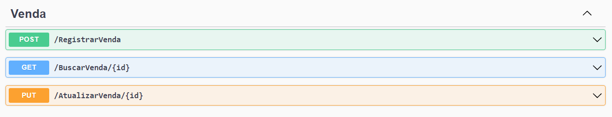

# Projeto Técnico de API REST
### .NET Core

##### Projeto que simula uma venda com armazenamento em memória.

## Tecnologias Utilizadas

##### Visual Studio 2022
##### .Net Core
##### C#

## Autor
##### Katarine Albuquerque
##### Linkedin: <a href="https://www.linkedin.com/in/katarine-albuquerque/">/katarine-albuquerque</a>
##### GitHub: <a href="https://github.com/KatarineAlbuquerque">/KatarineAlbuquerque</a>
##### Portfólio GitHub: <a href="https://github.com/KatarineAlbuquerque/my-portfolio">/my-portfolio</a>

